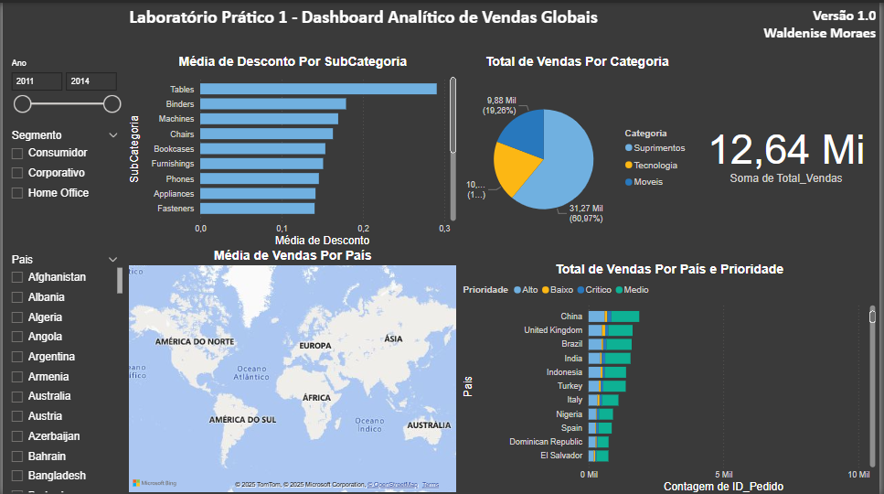

# 🌍 Laboratório Prático 1 — Dashboard Analítico de Vendas Globais

Este repositório contém o projeto desenvolvido durante o **Laboratório Prático 1** do curso **"Microsoft Power BI para Business Intelligence e Data Science"**, com foco na criação de um **dashboard analítico interativo** para análise de vendas globais.

---

## 🎯 Objetivo

Desenvolver um dashboard no **Power BI** capaz de oferecer insights estratégicos sobre o desempenho global de vendas, permitindo ao usuário:

- Visualizar e analisar o valor total vendido
- Explorar categorias, subcategorias e prioridades de entrega
- Investigar descontos aplicados
- Entender a distribuição geográfica das vendas

---

## ❓ Perguntas de Negócio Respondidas

O dashboard responde às seguintes perguntas principais:

1. **Qual o valor total de vendas?**  
   ➤ Soma de todas as vendas realizadas no período.

2. **Quantas vendas foram realizadas por categoria de produto?**  
   ➤ Distribuição da quantidade de vendas por categoria (Ex: Móveis, Tecnologia, Papelaria).

3. **Quantas vendas foram realizadas por país considerando a prioridade de entrega?**  
   ➤ Visualização do volume de vendas por país, segmentadas por prioridade (Alta, Média, Baixa).

4. **Qual foi a média de desconto nas vendas por subcategoria de produto?**  
   ➤ Cálculo da média percentual de desconto por subcategoria.

5. **Quais países tiveram maior média de valor de venda?**  
   ➤ Representação no **mapa interativo** com destaque para países com maior ticket médio.

---

## 🎛️ Filtros Interativos Disponíveis

O usuário pode interagir com o dashboard por meio de filtros que permitem segmentações por:

- **Ano**
- **Segmento de cliente**
- **País**

Esses filtros tornam a análise mais dinâmica e adaptada a diferentes contextos.

---

## 🧰 Ferramentas Utilizadas

- 💻 Power BI Desktop
- 📁 Dataset fornecido pelo curso
- 🎓 Curso: *Microsoft Power BI para Business Intelligence e Data Science*

---

## 🖼️ Visual do Dashboard

---

## 📚 Curso

Projeto desenvolvido no curso:  
🔗 **Microsoft Power BI para Business Intelligence e Data Science**  
Plataforma: *[DataScienceAcademy]*

---

## 👩‍💻 Autora

**Waldenise de Oliveira Moraes**  
🔗 [LinkedIn](https://www.linkedin.com/in/waldenise-moraes/)  
🔗 [GitHub](https://github.com/WaldeniseMoraes)

---

Dashboard analítico de vendas globais desenvolvido com Power BI no Laboratório Prático 1 do curso Microsoft Power BI para BI e Data Science.
